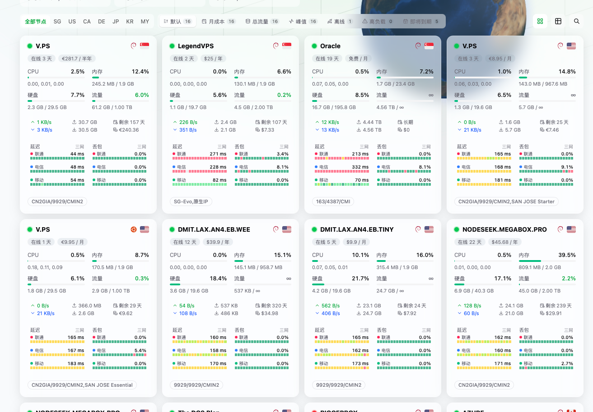

# Komari Glassmorphism 三网延迟版

本项目转载并二次修改自 [sanrokamlan-prog/komari-theme-Glassmorphism](https://github.com/sanrokamlan-prog/komari-theme-Glassmorphism)。

本仓库仅在原项目基础上增加中国联通、中国电信、中国移动三家运营商的延迟与丢包数据展示，其余主要功能、界面设计和代码均来源于原项目。

感谢原项目作者 **sanrokamlan-prog** 及所有贡献者的开发、维护与开源分享。

如需查看原版功能、安装方式及最新版本，请访问原项目：

https://github.com/sanrokamlan-prog/komari-theme-Glassmorphism

本项目继续遵循原项目的 MIT License。
