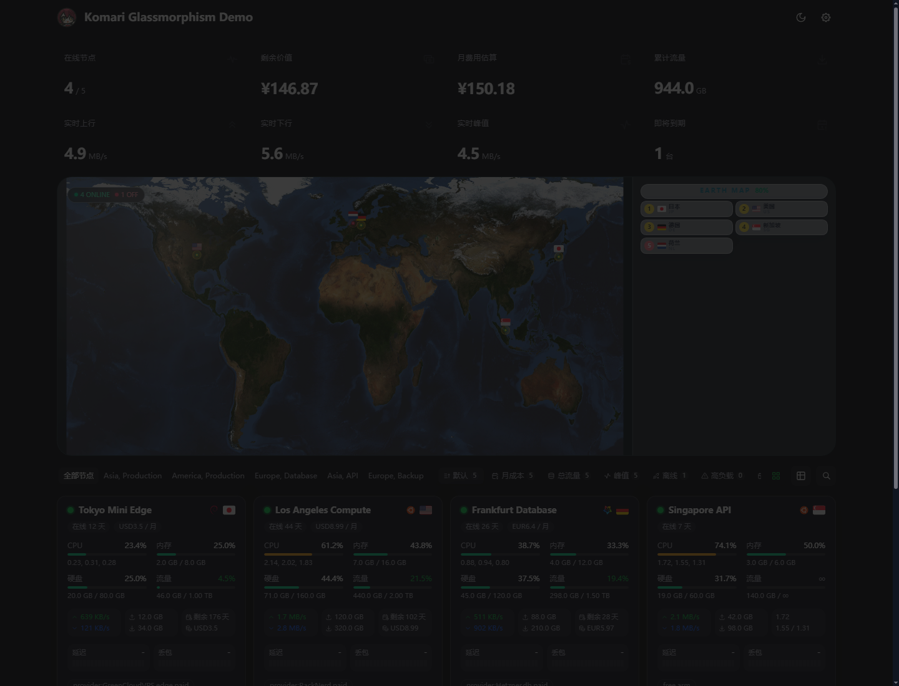
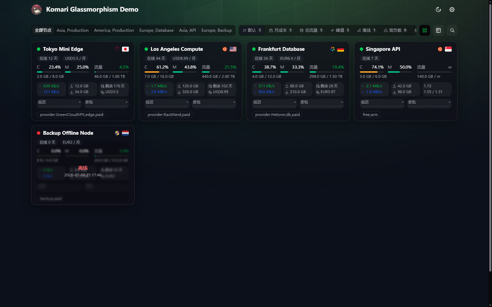
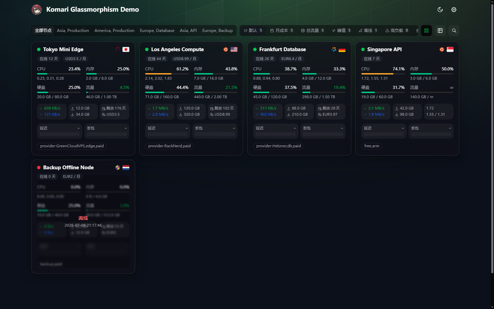
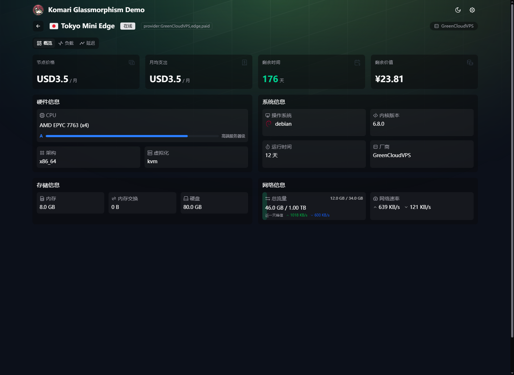
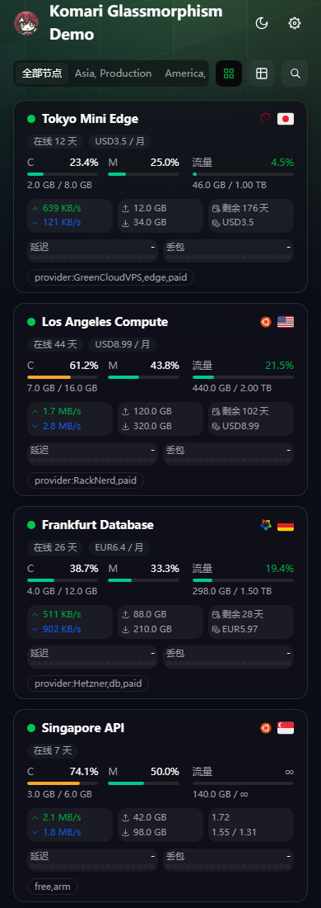

# Komari Glassmorphism

一款面向 **Komari Monitor** 的现代毛玻璃主题。它不是独立部署的通用 Web 应用，而是可以直接导入 Komari 的主题包：透明卡片、柔和背景、3D 地球/地图、多指标总览、节点卡片/列表和详情页都围绕服务器监控场景重新整理，并新增联通、电信、移动三网延迟与丢包展示。


[效果预览](#效果预览) · [功能亮点](#功能亮点) · [主题设置全览](#主题设置全览) · [安装使用](#安装使用) · [本地开发](#本地开发)


## 一屏看懂

| 项目     | 内容                                                                       |
| -------- | -------------------------------------------------------------------------- |
| 主题定位 | Komari Monitor 主题包，可上传到 Komari 后台使用                            |
| 版本来源 | [komari-theme.json](komari-theme.json) 的 `version` 字段是唯一发布版本来源 |
| 视觉风格 | 毛玻璃卡片、柔和渐变背景、浅色/深色自适应                                  |
| 首页能力 | 总览卡片、地球/地图、节点卡片/列表、快捷筛选和排序                         |
| 详情能力 | 节点基础信息、负载图表、延迟图表、分区标签页可选                           |
| 配置方式 | Komari 后台托管主题设置，无需改代码即可开关大量功能                        |
| 发布产物 | Release 附件中的 `komari-theme-Glassmorphism-build-*.zip`                  |

## 效果预览

> 以下截图来自本地模拟 Komari API 后运行的真实构建页面，覆盖首页、mini 卡片、列表、详情页和移动端。

| 首页总览 + 地图                                               | mini 高密度卡片                                            |
| ------------------------------------------------------------- | ---------------------------------------------------------- |
|  |  |

| 列表视图                                           | 节点详情概览                                                 |
| -------------------------------------------------- | ------------------------------------------------------------ |
|  |  |

| 移动端 mini 卡片                                             |
| ------------------------------------------------------------ |
|  |

## 功能亮点

### 1. 毛玻璃监控首页

- 半透明玻璃卡片、柔和阴影和渐变背景，适合公开状态页和自用监控面板。
- 响应式布局适配桌面、平板和手机，移动端分组与快捷控制支持横向滚动。
- 支持浅色、深色、北京时间自动日夜模式；访客还可以在当前浏览器本地切换。
- 可开启「减弱过渡动画」，在低性能设备或大节点数量场景下减少动效压力。

### 2. 三种地球 / 地图展示

- **realistic**：真实贴图 3D 地球，视觉更强。
- **cobe**：点阵科技风地球，轻量且醒目。
- **tiled**：平铺世界地图，更适合节点多、需要快速看地区分布的面板。
- 支持停止自动旋转、隐藏地球、隐藏整个头部总览，适合做紧凑首页。

### 3. 总览卡片可按场景切换

内置多套头部卡片方案：

- **基础**：常用内存、硬盘、剩余价值、流量、实时上下行等。
- **运维**：在线/离线、高负载、流量预警、连接峰值、平均 CPU/负载等。
- **财务**：即将到期、月费用、年费用、剩余价值。
- **流量**：累计流量、实时峰值、上行最高、下行最高、流量预警。
- **完整**：尽可能展示全部统计项。
- **自定义**：自己填写 key 控制顺序和显示内容。

### 4. 首页快捷筛选与排序

节点分组旁提供快捷控制，可以快速切换：

- 默认排序
- 月成本排序
- 总流量排序
- 上行 / 下行排序（可通过自定义快捷按钮启用）
- 实时峰值排序
- 离线节点
- 高负载节点
- 即将到期节点

还可以设置进入首页时默认启用哪一种快捷模式，并可开启「离线节点置底」，让在线机器优先显示。

### 5. 卡片 / 列表双视图

- **卡片视图**：显示 CPU、内存、硬盘、流量、实时网速、累计流量、到期/价格、延迟和丢包。
- **mini 卡片尺寸**：新增最小高密度卡片，适合节点很多时一屏放下更多机器。
- **compact / comfortable / large**：继续保留原有紧凑、舒适、大卡片尺寸。
- **列表视图**：适合快速扫节点，信息栏支持厂商、地区、城市、ASN、自定义标签、分组等字段。
- 列表信息栏可以整体关闭，也可以自定义字段顺序；没有内容的行会自动隐藏。

### 6. 联通 / 电信 / 移动三网 Ping

节点卡片原有的“延迟 + 丢包”双栏布局保持不变，面板内新增三行运营商数据：

- 联通：任务名称包含 `联通`、`Unicom` 或 `CUCC`；
- 电信：任务名称包含 `电信`、`Telecom`、`CTCC`、`ChinaNet` 或 `CN2`；
- 移动：任务名称包含 `移动`、`Mobile`、`CMCC`、`CMI` 或 `CMIN2`。

每条线路分别计算最近一小时的平均延迟、平均丢包和 20 段历史柱状条。某线路没有对应任务时显示 `-`，不会拿其他线路的数据代替。建议在 Komari 后台将三个 Ping 任务直接命名为 `联通`、`电信`、`移动`。

### 7. 节点详情增强

- 展示节点系统、地区、厂商、ASN、CPU、内存、硬盘、网络和 Komari agent 信息。
- 负载图表、延迟图表按需加载，避免首页承担过多资源。
- 可选开启详情页分区标签页：概览、负载、延迟分开查看；默认仍保持纵向连续展示。
- CPU 趣味评分根据型号关键字估算，仅作娱乐参考。

### 8. 财务、隐私与公开展示

- 支持价格、周期、到期时间、剩余价值、月成本、年成本等财务类展示。
- 支持多货币格式化和汇率换算，月成本排序可排除免费节点标签。
- 可配置「未登录隐藏价格」，访客看不到价格、剩余价值和费用类卡片。
- 可配置未登录隐藏后台入口，加载状态下也避免后台入口或访客 IP 组件闪现。
- 登录后可查看 Komari hidden 节点，未登录公开首页仍会过滤 hidden 节点。

### 9. 自定义背景和公告

- 首页公告支持简单 Markdown。
- 背景支持图片或视频。
- 可分别配置亮色 / 暗色背景地址。
- 支持背景模糊和遮罩强度，正数增加黑色遮罩，负数降低背景透明度。

## 主题设置全览

主题设置由 [komari-theme.json](komari-theme.json) 声明，并在 Komari 后台以托管设置展示。

### 基础设置

| 设置         | 作用                                                   |
| ------------ | ------------------------------------------------------ |
| 默认主题模式 | `beijing` 北京时间自动、`light` 浅色、`dark` 深色      |
| 数据更新间隔 | 实时数据刷新秒数，建议 1-10 秒                         |
| RPC 连接模式 | HTTP 兼容性最好；反代支持 WebSocket 时可切换 websocket |
| 默认视图模式 | 首页默认卡片或列表                                     |
| 节点卡片尺寸 | `mini`、`compact`、`comfortable`、`large` 四档         |

### 首页模块设置

| 设置                           | 作用                                         |
| ------------------------------ | -------------------------------------------- |
| 启用公告 / 公告标题 / 公告内容 | 在首页显示自定义公告，内容支持简单 Markdown  |
| 停止地球旋转                   | 默认不自动旋转，用户仍可手动拖拽             |
| 地球样式                       | realistic、cobe、tiled 三种地球/地图模式     |
| 隐藏地球 / 隐藏头部            | 让首页更紧凑，或只保留节点列表               |
| 显示访客信息                   | 控制底部访客 IP 条和左下角详情卡片           |
| 头部卡片方案                   | 基础、运维、财务、流量、完整、自定义         |
| 高级：自定义头部卡片           | 用英文逗号填写卡片 key，自定义显示内容和顺序 |
| 隐藏后台入口                   | 未登录时隐藏顶部后台管理入口                 |
| 未登录隐藏价格                 | 未登录访客隐藏价格、剩余价值和费用类卡片     |
| 厂商自定义别名                 | 给 VPS 厂商配置别名，提高识别准确度          |
| 减弱过渡动画                   | 减少页面过渡动画，提高弱设备体验             |

### 节点与快捷控制

| 设置                 | 作用                                                                                              |
| -------------------- | ------------------------------------------------------------------------------------------------- |
| 显示主页快捷控制     | 控制分组旁快捷按钮是否展示                                                                        |
| 快捷控制方案         | 基础、流量、运维、完整、自定义                                                                    |
| 高级：自定义快捷按钮 | 自己填写 `default,monthlyCost,totalTraffic,upload,download,peak,offline,highLoad,expiring` 等 key |
| 列表信息栏           | 控制列表视图是否展示节点元信息                                                                    |
| 列表信息字段         | 自定义 provider、region、city、asn、tags、group 的顺序                                            |
| 列表显示自定义标签   | 列表字段包含 tags 时，控制是否显示自定义标签                                                      |
| 详情页分区标签页     | 将详情页拆为概览、负载、延迟标签页                                                                |
| 离线节点置底         | 在线节点优先，离线节点排到最后；离线快捷筛选仍只显示离线                                          |
| 默认快捷模式         | 进入首页默认启用的筛选/排序模式                                                                   |
| 高负载阈值           | CPU、内存或硬盘达到阈值时归为高负载                                                               |
| 流量预警阈值         | 流量配额使用率达到阈值时归为预警                                                                  |
| 即将到期天数         | 剩余天数小于等于该值时归为即将到期                                                                |

### 自定义背景

| 设置             | 作用                              |
| ---------------- | --------------------------------- |
| 启用自定义背景   | 开启后使用自定义图片或视频背景    |
| 背景类型         | image 或 video                    |
| 亮色模式背景地址 | 亮色模式下使用的背景 URL          |
| 暗色模式背景地址 | 暗色模式下使用的背景 URL          |
| 背景模糊半径     | 背景高斯模糊 px 值                |
| 背景遮罩强度     | -100 到 100，控制透明度或黑色遮罩 |

## 安装使用

1. 打开 [Releases](https://github.com/sanrokamlan-prog/komari-theme-Glassmorphism/releases) 页面。
2. 下载最新版本的 `komari-theme-Glassmorphism-build-*.zip`。
3. 登录 Komari Monitor 后台，进入 **设置 → 主题管理**。
4. 点击 **上传主题**，选择下载的 zip 文件。
5. 在主题设置里按需调整卡片尺寸、地球样式、总览卡片、快捷控制和背景。
6. 刷新页面，即可应用主题。

> 请上传 Release 附件中的主题 zip 包，不要直接上传源码压缩包。

## 本地开发

### 环境要求

| 工具    | 版本                      |
| ------- | ------------------------- |
| Node.js | `^20.19.0` 或 `>=22.12.0` |
| Bun     | `>=1.2.0`                 |

### 常用命令

```bash
# 安装依赖
bun install

# 启动 Vite 开发服务器
bun run dev

# 自动修复并检查代码风格
bun run lint

# 类型检查 + 生产构建 + 主题 zip 打包
bun run build

# 预览生产构建
bun run preview
```

构建成功后会生成：

- `dist/`
- `komari-theme-Glassmorphism-build-<short-sha>.zip`

zip 包内包含 Komari 主题需要的 `komari-theme.json`、`preview.png` 和 `dist/`。

### 版本号

发布版本只需要修改 [komari-theme.json](komari-theme.json) 顶层 `version` 字段。构建时注入到页面底部的 `__BUILD_VERSION__` 也会读取这个字段，避免在多个文件里同步版本号。

## 技术栈

| 类别        | 技术                              |
| ----------- | --------------------------------- |
| 框架        | Vue 3                             |
| 构建        | Vite 7                            |
| 包管理器    | Bun                               |
| UI 基础     | reka-ui + shadcn-vue 风格本地组件 |
| 样式        | Tailwind CSS v4 + tw-animate-css  |
| 状态管理    | Pinia                             |
| 路由        | Vue Router                        |
| 图标        | Iconify                           |
| 图表        | ECharts + vue-echarts             |
| 地球 / 地图 | globe.gl、three、cobe             |
| 工具        | VueUse、dayjs                     |
| 代码规范    | ESLint + @antfu/eslint-config     |

## 项目结构

```text
.
├─ docs/                 # README、预览图和发帖文案
├─ public/images/        # 运行时图片资源：旗帜、系统 logo 等
├─ src/
│  ├─ components/        # 业务组件与本地 UI 组件
│  ├─ composables/       # 可复用组合式逻辑
│  ├─ stores/            # Pinia 状态
│  ├─ styles/            # 全局 Tailwind v4 样式与设计 token
│  ├─ utils/             # API、RPC、格式化、地理与财务工具
│  └─ views/             # 首页与节点详情页
├─ komari-theme.json     # Komari 主题清单、托管配置和发布版本号
├─ vite.config.ts        # Vite 构建与主题 zip 打包配置
└─ package.json          # 项目命令与依赖版本
```

## 更新日志

### v2.4.0

- 保留节点卡片原有“延迟 + 丢包”双栏样式，在面板内新增联通、电信、移动三网独立数据。
- 根据 Ping 任务名称自动识别运营商，分别计算平均延迟、平均丢包和历史柱状记录。
- 支持任务名称关键字：联通/Unicom/CUCC、电信/Telecom/CTCC/ChinaNet/CN2、移动/Mobile/CMCC/CMI/CMIN2。
- 单线路完全丢包时仍能正确显示 `100.0%`，延迟显示 `-`。
- 兼容 mini、compact、comfortable、large 四种节点卡片尺寸和移动端布局。

### v2.3.1

- 修复节点状态轮询时实时上行 / 下行、CPU 等卡片数据需要刷新浏览器才更新的问题。
- 确认节点卡片尺寸未配置时仍默认使用 `compact`；`mini` 仅作为可选高密度模式。

### v2.3.0

- 新增 `mini` 节点卡片尺寸，高密度展示更多节点；保留原有 `compact`、`comfortable`、`large` 三档。
- 新增「离线节点置底」设置，常用排序中在线节点优先，离线快捷筛选保持只显示离线节点。
- 优化加载阶段的后台入口和访客信息显示，避免初始状态闪现。
- 登录后可查看 Komari hidden 节点，未登录公开首页仍过滤 hidden 节点。
- 发布版本号统一以 [komari-theme.json](komari-theme.json) 为准，构建显示版本同步读取该字段。
- 重构 README，补全主题设置、隐藏功能和使用亮点说明。

### v2.2.0

- 优化列表视图字体与颜色层级，新增可配置的信息栏，默认展示厂商、地区和 ASN；城市字段改为可选开启。
- 新增详情页分区标签页开关，默认保持传统纵向布局，可在托管主题设置中切换为分区展示。
- 精简首页默认快捷控制，默认不再显示上行/下行；自定义配置仍可启用。
- 改进连接稳定性、到期/剩余价值计算、安全位置标签、隐藏节点一致性和基础交互可访问性。

### v2.1.1

- 优化首页总览卡片和节点详情中的费用 / 剩余价值展示，只保留带货币符号的金额。
- 同步主题清单与包版本到 `v2.1.1`。

### v2.1.0

- 新增后台托管默认主题模式，支持北京时间自动日夜切换。
- 默认背景调整为 Emerald 风格绿色顶光、网格和玻璃感表面。
- 财务计算新增 CAD，并补齐 RUB、CHF、INR、VND、THB 等货币支持。

更多历史版本请查看 [Releases](https://github.com/sanrokamlan-prog/komari-theme-Glassmorphism/releases)。

## 致谢

- 原始主题作者：Tokinx
- 捐赠支持：可乐杯里泡枸杞、Leo Lin（排名不分先后）
- [Komari](https://github.com/komari-monitor/komari)
- [Komari Naive](https://github.com/tonyliuzj/komari-naive)
- [Vue](https://vuejs.org/)
- [Vite](https://vitejs.dev/)
- [reka-ui](https://reka-ui.com/)
- [Tailwind CSS](https://tailwindcss.com/)

本项目在原有 Komari Emerald 主题基础上进行了毛玻璃风格改造，感谢原作者和社区项目的贡献。

## License

[MIT](LICENSE)
